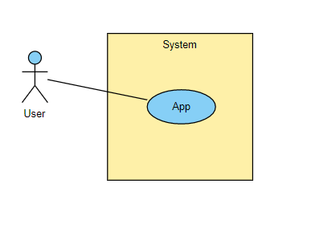
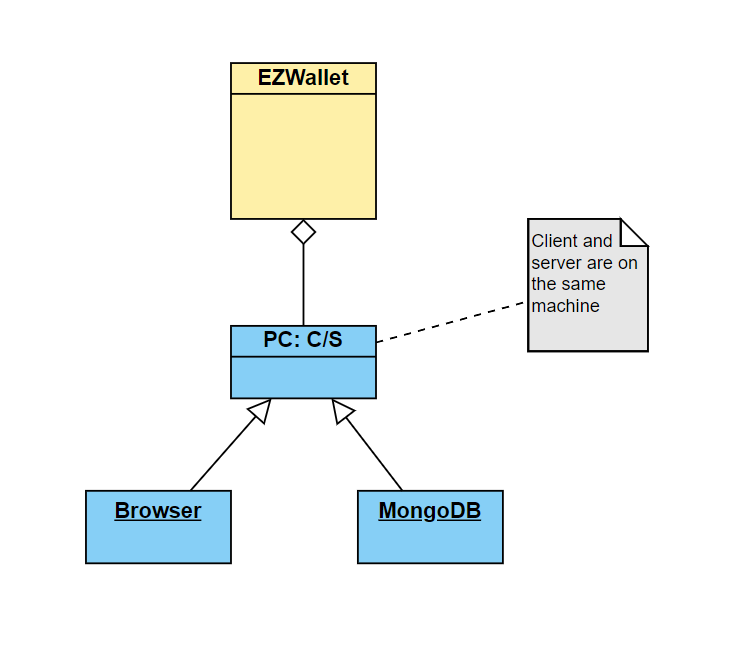
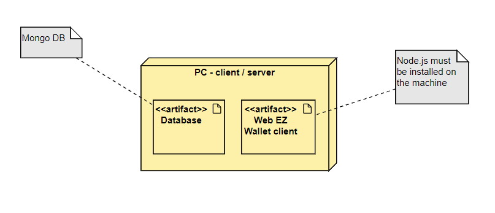

# Requirements Document - current EZWallet

Date: 

Version: V1 - description of EZWallet in CURRENT form (as received by teachers)

 
| Version number | Change |
| ----------------- |:-----------|
| | | 

# Contents

- [Requirements Document - current EZWallet](#requirements-document---current-ezwallet)
- [Contents](#contents)
- [Informal description](#informal-description)
- [Stakeholders](#stakeholders)
- [Context Diagram and interfaces](#context-diagram-and-interfaces)
	- [Context Diagram](#context-diagram)
	- [Interfaces](#interfaces)
- [Stories and personas](#stories-and-personas)
- [Functional and non functional requirements](#functional-and-non-functional-requirements)
	- [Functional Requirements](#functional-requirements)
	- [Non Functional Requirements](#non-functional-requirements)
- [Use case diagram and use cases](#use-case-diagram-and-use-cases)
	- [Use case diagram](#use-case-diagram)
		- [Use case 1, UC1](#use-case-1-uc1)
				- [Scenario 1.1](#scenario-11)
				- [Scenario 1.2](#scenario-12)
				- [Scenario 1.x](#scenario-1x)
		- [Use case 2, UC2](#use-case-2-uc2)
		- [Use case x, UCx](#use-case-x-ucx)
- [Glossary](#glossary)
- [System Design](#system-design)
- [Deployment Diagram](#deployment-diagram)

# Informal description
EZWallet (read EaSy Wallet) is a software application designed to help individuals and families keep track of their expenses. Users can enter and categorize their expenses, allowing them to quickly see where their money is going. EZWallet is a powerful tool for those looking to take control of their finances and make informed decisions about their spending.

# Stakeholders

| Stakeholder name  | Description | 
| ----------------- |:-----------:|
| **User** | Uses the system. There are different user profiles (see later). In our case is formed by all the users of the application that are logged in the system and have access to the app.|
| **Software Developer** | The developer writes the code.|
| **Administrator** | Has more functions available than normal users (e.g. `getUsers()`). |

# Context Diagram and interfaces

## Context Diagram
<!-- \<Define here Context diagram using UML use case diagram> -->

<!-- \<actors are a subset of stakeholders> -->

## Interfaces
<!-- \<describe here each interface in the context diagram> -->

| Actor | Logical Interface | Physical Interface  |
| ------------- |:-------------:| -----:|
| User | GUI (register, logIn/logOut, create categories, check expenses, add/remove transactions)  |  PC (Screen and Keyboards) |

<!-- \<GUIs will be described graphically in a separate document> -->

# Stories and personas
\<A Persona is a realistic impersonation of an actor. Define here a few personas and describe in plain text how a persona interacts with the system>

\<Persona is-an-instance-of actor>

\<stories will be formalized later as scenarios in use cases>

# Functional and non functional requirements

## Functional Requirements

\<In the form DO SOMETHING, or VERB NOUN, describe high level capabilities of the system>

\<they match to high level use cases>

| ID    	| Description  |
| ------------- |:-------------:|
|  FR1 	| Manage accounts |
|  FR1.1 	|  Register account |
|  FR1.2 	|  Login |
|  FR1.3 	|  Logout |
|  FR1.4 	|  Get Users |
|  FR1.5 	|  Authorize |
| FR2  | Manage transactions |
| FR2.1  | Create transactions |
| FR2.2  | Get transactions |
| FR2.3  | Delete transactions |
| FR3  | Manage categories |
| FR3.1  | Create categories |
| FR3.2  | Get categories |
| FR4  | Get labels |

## Non Functional Requirements

\<Describe constraints on functional requirements>

| ID        | Type (efficiency, reliability, ..)           | Description  | Refers to |
| ------------- |:-------------:| :-----:| -----:|
| NFR1 	| Usability  | Core functions for users (read transactions), should be used with no training by all users with at least 1yr experience with browsers | |
| NFR2 	| Availability |  99.9% uptime | |
| NFR3 	| Efficiency| All functions should be completed in 0.5s | |
| NFR4 	| Security|  Access only to authorized users | |
| NFR5 	| Maintainability |The facility to  modify software components,  to correct faults, improve performance  or to adapt to a changed environment. For measures, refer to `EstimationV1.md` | |
| NFR6 	| Portability | Effort to redeploy application on other platform, browser compatibility: javascript support| |
| NFR7  | Correctness | Capability to provide intended functionality in all cases (no error while querying the database, show only data required). |  |

# Use case diagram and use cases

## Use case diagram
\<define here UML Use case diagram UCD summarizing all use cases, and their relationships>

\<next describe here each use case in the UCD>
### Use case 1, UC1
| Actors Involved        |  |
| ------------- |:-------------:| 
|  Precondition     | \<Boolean expression, must evaluate to true before the UC can start> |
|  Post condition     | \<Boolean expression, must evaluate to true after UC is finished> |
|  Nominal Scenario     | \<Textual description of actions executed by the UC> |
|  Variants     | \<other normal executions> |
|  Exceptions     | \<exceptions, errors > |

##### Scenario 1.1 

\<describe here scenarios instances of UC1>

\<a scenario is a sequence of steps that corresponds to a particular execution of one use case>

\<a scenario is a more formal description of a story>

\<only relevant scenarios should be described>

| Scenario 1.1 | |
| ------------- |:-------------:| 
|  Precondition     | \<Boolean expression, must evaluate to true before the scenario can start> |
|  Post condition     | \<Boolean expression, must evaluate to true after scenario is finished> |
| Step#        | Description  |
|  1     |  |  
|  2     |  |
|  ...     |  |

##### Scenario 1.2

##### Scenario 1.x

### Use case 2, UC2
..

### Use case x, UCx
..

# Glossary

\<use UML class diagram to define important terms, or concepts in the domain of the application, and their relationships> 

\<concepts must be used consistently all over the document, ex in use cases, requirements etc>

# System Design
<!-- \<describe here system design> -->

<!-- \<must be consistent with Context diagram> -->

# Deployment Diagram 

<!-- \<describe here deployment diagram > -->

